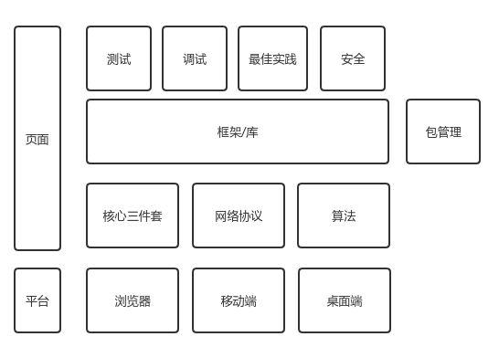

# 简介
该仓库用于归纳总结前端知识体系，勾勒适合自己的前端知识树（知识树的具体形态因人而异），记录个人学习笔记和总结。

先完成，后完美。以下的前端知识体系逐步完善中。	

# 前端知识体系

- [平台](#平台)
  - [浏览器](#浏览器)
    - [渲染引擎](#渲染引擎)
    - [脚本引擎](#脚本引擎)
  - [移动端](#移动端)
  - [桌面端](#桌面端)
- [页面](#页面)
  - [核心三件套](#核心三件套)
    - [HTML](#HTML)
    - [CSS](#CSS)
    - [JavaScript](#JavaScript)
    - [标准](#标准)
  - [网络协议](#网络协议)
  - [算法](#算法)
  - [框架/库](#框架)
  - [包管理](#包管理)
  - [测试](#测试)
  - [调试](#调试)
  - [最佳实践](#最佳实践)
  - [安全](#安全)

- ## 平台

  - ### 浏览器
    - #### 渲染引擎

    - #### 脚本引擎

  - ### 移动端

  - ### 桌面端

- ## 页面
  - ### 核心三件套
    - #### HTML

    - #### CSS

    - #### JavaScript

      - ##### ECMAScript

      - ##### DOM

      - ##### BOM	

    - #### 标准

  - ### 网络协议

  - ### 算法

  - ### 框架/库

  - ### 包管理

  - ### 测试

  - ### 调试

  - ### 最佳实践

  - ### 安全

# 延伸阅读
